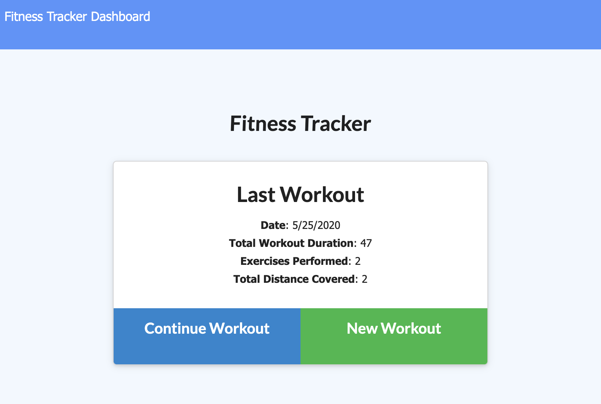

# Workout Tracker

This repository houses the files that implement a workout tracker.

### Purpose

This application provides a means to record workouts in a given day. It allows a user to record a new workout, or to continue to add exercises to their current workout. It provides input fields for both cardio and resistance exercises.

### Functionality

This application uses a Mongo database with a Mongoose schema. It handles routes with Express. Our class was given the front end for this application; it was our responsibility to implement the back end.

### Concepts and techniques
* MongoDB
* Mongoose
* mLab MongoDB add-on

https://github.com/davidcbalsley/hw12-workout-tracker

https://dcb-workout-tracker.herokuapp.com
